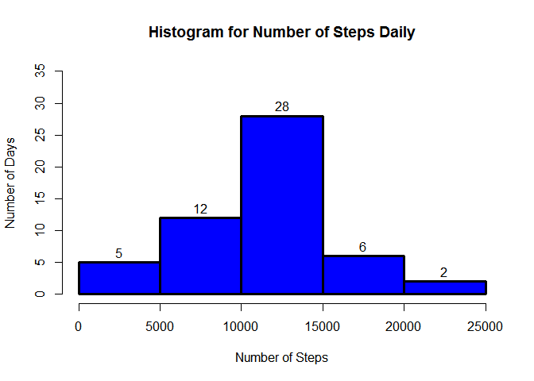

## Overview
Markdown file submitted by M. Amati in response to John Hopkins Data Science Course 5 Project #1

## Downloading Data
Below is the code used to download and prepare the activity data. See the ReadMe file for more detail on the data set.
The file is downloaded, unzipped, and opened as a R data frame called "activity."


```r
Dir<-"C:/Users/Mike/Documents/Coursera/JohnsHopkinsDataScience/Course5_Reproducible_Research/Project 1"
setwd(Dir)
fileURL<-"https://d396qusza40orc.cloudfront.net/repdata%2Fdata%2Factivity.zip"
zipfile<-paste(Dir,"Activity Monitoring",sep="/")
download.file(fileURL,zipfile)
unzip(zipfile, files = NULL, list = FALSE, overwrite = TRUE)
activity<-read.csv("activity.csv")
```
## What is the mean number of steps in a day?
This section aggregates the data by the date field, calculates the mean and median by day, and plots a histogram of the frequency of steps per day.  Missing values are left untouched at this point. 


```r
#Calculate the total number of steps taken each day
daily<-aggregate(steps~date,activity,sum)


#Calculate and report the mean and median of the total number of steps taken per day
average_steps<-mean(daily$steps)
median_steps<-median(daily$steps)
```
Not excluding missing values, the average number of steps per day is:

```
## [1] 10766.19
```
and the median number of steps is:

```
## [1] 10765
```
The histogram of daily steps is determined as follows


```r
##Code for Histogram
par(lwd=3)
with(daily, 
     hist(steps, 
     main="Histogram for Number of Steps Daily", 
     xlab="Number of Steps",
     ylab="Number of Days",
     border="black", 
     col="blue",
     ylim=c(0,35),
     labels = TRUE,
    
     )
)
```

<!-- -->


## What is the average daily activity pattern?
This section explores how steps activity varies throughout the day.  The data has been divided into 5 minute intervals, 
which correspond to time of day.  The intervals are of the form HHMM on a 24 hour clock, so, for example 835 corresponds
to 8:35 AM and 2150 corresponds to 21:50, or 9:50 PM. Again, at this point missing values have not been removed. 

The first step is to aggregate the data by the five minute interval, calculating the average for each interval
across all available days:


```r
period<-aggregate(steps~interval,activity,mean)
```
We can then view a line graph of the average activity by time of day: 


```r
xat<-c(0,200,400,600,800,1000,1200,1400,1600,1800,2000,2200,2400)
yat<-c(0,50,100,150,200)
with(period, 
     plot(interval,steps,type="l",
          xlab="Interval",
          ylab="Average Number of Steps",
          axes=FALSE,
          #ylim=c(0,10000000),
          #xlim=c(1998,2010),
          main = "Daily Pattern of Steps Taken"
     )
)
axis(side=1,at=xat,labels = c("",xat[2:12],""),pos=0)
axis(side=2,at=yat,labels=yat,pos=0)
```

<!-- -->


Finally, we can calculate the interval that has the highest average steps across all the days in the data set.

First we calculate the what the maximum number of steps is, then filter the data down to the record that contains that maximum:

```r
max_int_steps<-max(period$steps)
max_int<-period[period$steps==max_int_steps,1]
```
The period with the maximum average steps is:

```
## [1] 835
```
where an average of

```
## [1] 206.1698
```
steps were taken.


## Imputing Missing Values
Note that there are a number of days/intervals where there are missing values (coded as NA). 
The presence of missing days may introduce bias into some calculations or summaries of the data, so we want to 
re-evaluate our calculations after removing the missing values.

First we determine how many records have a missing value by determining the number of complete rows and subtracting it from
the number of rows in the original data set. 

```r
complete<-na.omit(activity)
rows_w_missing<-nrow(activity)-nrow(complete)
```
There are:

```
## [1] 2304
```
records with missing value. 

Next we develop a strategy to impute values for the missing data.  We calculate the median number of steps
by interval, using only complete records:


```r
complete_Med<-aggregate(steps~interval,complete,median)
```

Then we merge this median value back into the original data set, matching on the interval.
If the value is missing, we use the median and if it is not missing in the original data, we use the original value.


```r
merged<-merge(activity,complete_Med,by=("interval"))
merged$steps<-ifelse(is.na(merged$steps.x),merged$steps.y,merged$steps.x)
replaced<-merged[,c("interval","date","steps")]
```
This allows us to recalculate the average and median steps taken daily:

```r
daily_replaced<-aggregate(steps~date,replaced,sum)
replaced_mean<-mean(daily_replaced$steps)
replaced_med<-median(daily_replaced$steps)
```
The average daily steps after replacing the missing values is:

```
## [1] 9503.869
```
and the median number of steps daily after replacing the missing values is:

```
## [1] 10395
```
We can compare these mean and median values to those calculated without imputing missing values:

```r
avg_dif<-average_steps-replaced_mean
median_diff<-median_steps-replaced_med
```
These differences in the mean and median are, respectively:

```
## [1] 1262.32
```

```
## [1] 370
```

Finally we can make a new histogram of daily step frequency, using the data with imputed values:

```r
daily_replaced<-aggregate(steps~date,replaced,sum)
par(lwd=3)
with(daily_replaced, 
     hist(steps, 
          main="Histogram for Number of Steps Daily", 
          xlab="Number of Steps",
          ylab="Number of Days",
          border="black", 
          col="blue",
          ylim=c(0,35),
          labels = TRUE
          
     )
)
```

<!-- -->

## Are there differences in activity patterns between weekdays and weekends?
Since people's routines are often different on weekdays and weekends, it may be helpful to compare the average pattern of activity for both types of days separately.  

First, using the data where we've imputed missing values, we create a new factor value that indicates if each day is a
weekend or weekday. 


```r
replaced$daytype<-ifelse(weekdays(as.Date(replaced$date,format="%Y-%m-%d")) %in% list("Saturday","Sunday"),"Weekend","Weekday")
```

Next we aggregate this data by interval and type of day:


```r
bytype<-aggregate(steps~interval*daytype,replaced,mean)
```

Finally, using the lattice plot system, we develop a panel plot comparing weekends to weekdays:


```r
library(package = "lattice")
attach(bytype)
xyplot(steps~interval|daytype,type='l',layout=c(1,2),main="Comparison of Activity between Weekdays and Weekends")
```

<!-- -->

It seems activity on weekdays are more concentrated in the morning, perhaps on a workout or a walk to work, while activity is spread more evenly on weekends. 
